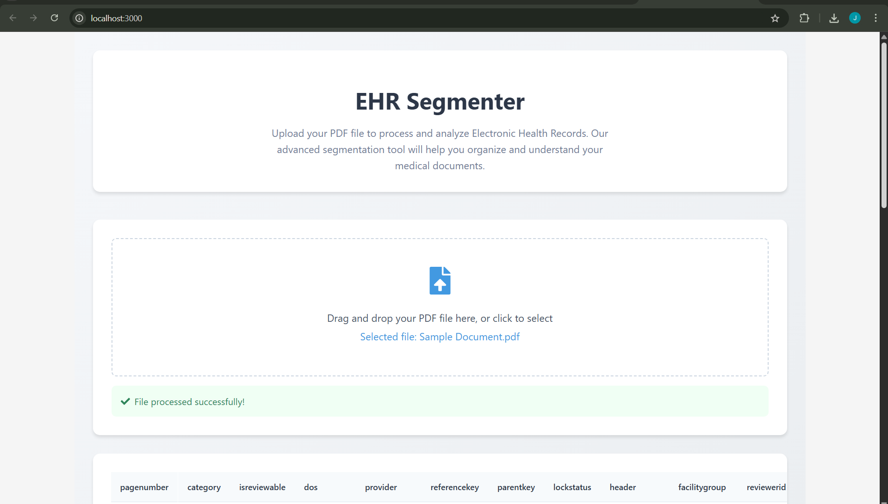

# EHR Segmentation System

A modern web application for processing Electronic Health Records (EHR) PDFs, segmenting them into logical groups, and exporting structured CSVs. Built with a React frontend and a Node.js/Python backend.

---

## Features
- **Drag-and-drop PDF upload** via a modern React interface
- **Automatic segmentation** of EHR PDFs into logical records/groups
- **Accurate extraction** of Date of Service (DOS), provider, header, and category
- **Robust grouping** using content similarity and metadata propagation
- **Consistent, sequential reference/parent keys** for each record
- **CSV export** of structured, review-ready data
- **Handles edge cases**: multi-page reports, missing metadata, interspersed records



---

## Project Structure
```
EHR/
├── backend/
│   ├── segmenter/
│   │   ├── ehr_segmenter_advanced.py
│   │   └── ehr_segmenter.py
│   ├── requirements.txt
│   ├── server.js
│   ├── package.json
│   ├── package-lock.json
│   ├── Sample Document.pdf
│   └── Sample Data.csv
├── client/
│   └── ... (React frontend)
└── venv/ (optional Python virtual environment)
```

---

## Requirements
- **Python 3.8+** (for backend PDF processing)
- **Node.js 14+** (for backend server and frontend)
- **pip** and **npm**

### Python Packages (install in backend/)
```
pip install -r requirements.txt
```

### Node Packages (install in backend/ and client/)
```
cd backend && npm install
cd ../client && npm install
```

---

## Setup & Running

### 1. Backend (Node.js + Python)
- From the `backend/` directory:
  ```bash
  npm install
  # (Optional) Python venv:
  python -m venv venv
  venv\Scripts\activate  # (Windows)
  pip install -r requirements.txt
  node server.js
  ```
- The backend runs at [http://localhost:5000](http://localhost:5000)

### 2. Frontend (React)
- From the `client/` directory:
  ```bash
  npm install
  npm start
  ```
- The frontend runs at [http://localhost:3000](http://localhost:3000)

### 3. (Optional) Run both together
- If `concurrently` is set up in backend/package.json:
  ```bash
  npm run dev
  ```

---

## Usage
1. Open [http://localhost:3000](http://localhost:3000) in your browser.
2. Drag and drop or select a PDF file to upload.
3. The backend processes the PDF, segments records, and returns a CSV.
4. The frontend displays the CSV in a table and allows you to download it.

---

## How It Works
- **Text Extraction:** Uses `pdfplumber` to extract text from each page.
- **Metadata Extraction:**
  - Extracts headers, dates (DOS), and provider/facility info
  - Ignores irrelevant dates (e.g., DOB)
  - Uses context and position to find the most likely DOS
- **Category Detection:**
  - Maps headers/content to standard categories (e.g., Laboratory Report = 24, Progress Note = 16)
- **Grouping:**
  - Groups pages using content similarity, header, DOS, and provider
  - Propagates the most common metadata within each group
- **Key Assignment:**
  - Assigns sequential `referencekey` (starting at 120991)
  - Sets `parentkey = 0` for the first page in a group, and to the first page's key for others
- **Output:**
  - Generates a CSV with columns:
    - pagenumber, category, isreviewable, dos, provider, referencekey, parentkey, lockstatus, header, facilitygroup, reviewerid, qcreviewerid, isduplicate

---

## Edge Cases Handled
- Multi-page reports
- Interspersed records
- Missing or inconsistent metadata
- Varying record lengths
- Inconsistent headers/footers

---

## Getting Started: Cloning the Repository

1. **Clone the repository:**
   ```bash
   git clone https://github.com/jiya19g/EHR-segmenter.git
   cd EHR-segmenter
   ```
2. Follow the setup instructions above for backend and frontend.

---

## Contributing & Feature Development

We welcome contributions! To add new features or improvements:

1. **Fork the repository** and create a new branch for your feature or fix.
2. **Make your changes** in the appropriate directory:
   - Backend logic: `backend/segmenter/`
   - Frontend UI: `client/`
3. **Test your changes** locally (see setup instructions above).
4. **Submit a Pull Request (PR)** with a clear description of your changes and why they improve the project.
5. The maintainers will review your PR and provide feedback or merge it.

---

## Suggestions for Improvements
- Add user authentication and access control
- Support for batch PDF uploads
- More advanced NLP for section/field extraction
- Export to additional formats (Excel, JSON)
- Add audit logs and processing history
- Dockerize the backend for easier deployment
- Add unit and integration tests
- Improve error handling and user feedback
- Add support for more EHR formats and languages
- Enhance the UI with analytics and visualizations

---

## License
MIT 
